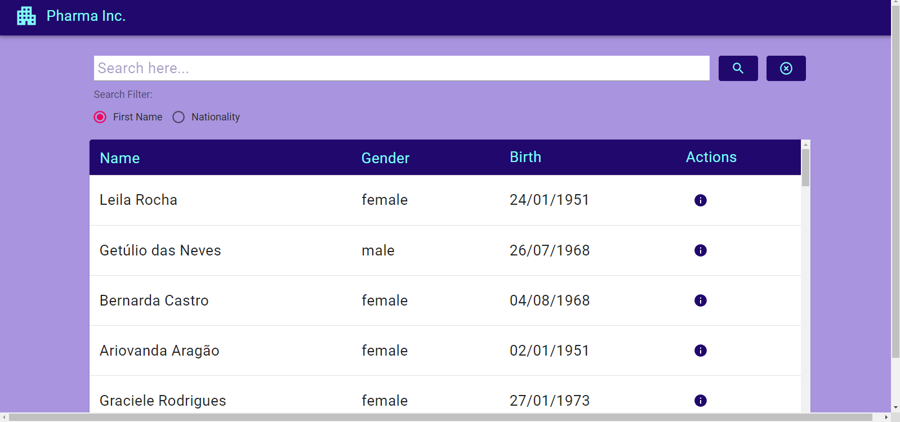
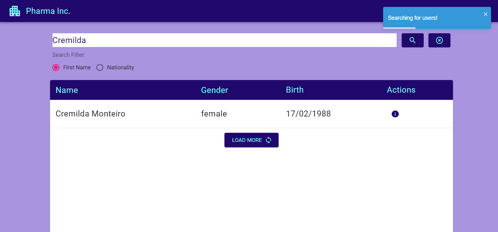
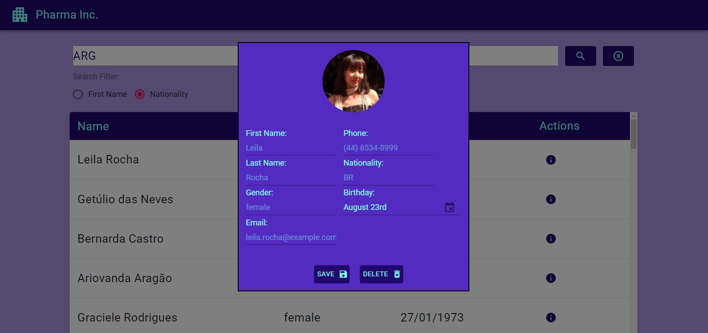

# Desafio Pharma Inc.

## Instalação
##### OBS: todos os comandos são considerando a pasta root (challenge-202021209) como inicial.

O projeto está divido entre a **API e frontend**, então serão necessárias duas instalações, uma dentro da pasta API:

    $ cd API
    $ yarn install

E outra no **front**:

    $ cd frontend
    $ yarn install

## Rodando o projeto

Novamente, como o projeto está dividido em duas partes, primeiro iniciamos o **backend**:

    $ cd API
    $ yarn start

E depois no **front**:

    $ cd frontend
    $ yarn start

A aplicação tem somente uma página, onde pode-se realizar a busca por nome ou nacionalidade de usuário, ordenar a tabela por nome ou gênero e ainda editar ou excluir um usuário clicando no botão da coluna Actions.

O resultado de uma busca é mostrado como a imagem, tanto por nome quanto por nacionalidade:

Se tentarmos carregar mais usuários com o nome buscado, receberemos um aviso que todos os usuários já foram encontrados.

Clicando no botão ao lado da lupa de busca, a busca é resetada. Caso seja feita uma busca com um parâmetro não existente, recebemos um aviso:

Clicando no botão de informações do usuário, é mostrada a tela para editar seus dados ou deletar.

Editando um campo e salvando, é dado um aviso de edição realizada com sucesso e a tabela é atualizada.

O mesmo acontece quando um usuário é deletado.

## Rotas

Informações mais detalhadas das rotas no [swagger](https://petstore.swagger.io/?url=https://raw.githubusercontent.com/dutomazoni/challenge-20201209/master/API/Routes/swagger.yaml).

## Testes das rotas

Para realizar os testes das rotas, basta entrar na pasta API e rodar o seguinte script:

    $ cd API
    $ yarn start-and-test
